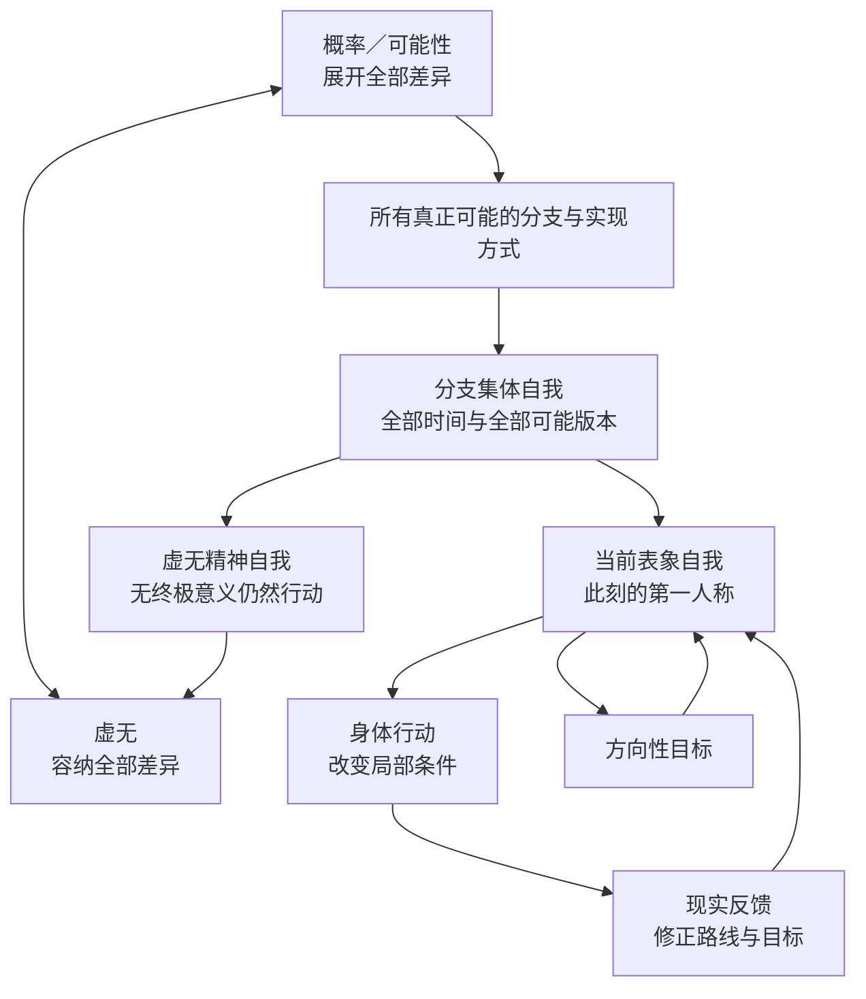

  

# 多恩可能性之圆

> **虚无没有判你失败。它甚至没有资格禁止你成功。**

**一套从虚无主义出发，终极回答“我是谁”，容纳无穷可能，并把虚无转化为行动力量的绝对自洽体系。**

大多数思想体系在虚无面前有两种退路：要么重新编造一个终极意义，要么劝人接受消沉。《多恩可能性之圆》不走任何一条退路。

它直接接受最彻底的起点——**世界没有预设的终极意义**——然后继续向前：

> 如果一切终究无所谓，那么认真、创造、成功和活得精彩，同样是无所谓所允许的可能。

这不是一句安慰，而是一套完整运行的系统：从虚无、可能性与五层自我出发，经过目标、行动、反馈与第一人称收敛，最终形成一个不会被失败和无意义轻易摧毁的主体。

## 它能把人带到哪里

- **不再害怕没有意义**：世界是否提供终极答案，不再决定你今天能不能行动。
- **不再害怕失败**：一次失败仍然真实，但它只是当前分支的结果，不是对全部自我的终极判决。
- **敢于追求任何仍真正可能的成就**：目标越大，越需要行动、学习、反馈和修正，而不是先向虚无申请许可。
- **获得一个更完整的“我”**：你不只是此刻孤立的一点，而是身体、经验、全部可能自我、行动精神与虚无背景共同构成的多层主体。
- **把豁达变成现实助力**：当失败不再等于彻底毁灭，人就更敢选择、更能坚持，也更有条件提高目标实现的现实概率。

在这个体系里：

> **意义可以归零，行动不必归零；失败可以是真的，但不是终极判决；目标可以无限远，但下一步必须真实发生。**

## 为什么值得读

因为它试图一次回答五个通常被拆散的终极问题：

1. **如果世界没有终极意义，我为什么还要行动？**
2. **如果我每一刻都在变化，到底什么才是“我”？**
3. **无数可能的我，与此刻正在体验的我是什么关系？**
4. **怎样既相信目标终将实现，又不逃避现实反馈和责任？**
5. **虚无、概率、自由、失败和成功，能否进入同一个自洽系统？**

只回答其中一个问题并不罕见。真正困难的是让五个答案彼此兼容，而且能够从最高层的虚无一路运行到今天最小的一次身体行动。

《可能性之圆》要做的正是这件事。它不是散落的励志句子，也不是把几种旧理论换名拼接，而是一套从本体论、自我论到行动论闭环运行的框架。

## 作者已经取得的初步验证

这套体系首先在作者多恩（touen）本人身上运行。

在长期面对不确定选择、失败可能与“人生也许没有任何终极意义”的过程中，作者得到的实际变化包括：

- 可以平静接受世界没有预设意义，而不陷入消沉；
- 不再把失败理解成整个自我的毁灭；
- 面对高目标时更敢选择、更敢行动，也更能承担结果；
- 能在没有终极保证的情况下保持豁达、自由和持续前进；
- 把“无所谓”从放弃的理由，变成“任何有所谓都可以发生”的开放背景。

这证明至少对作者本人而言，《可能性之圆》已经不只是纸面逻辑，而是一套能够真实运行的精神与行动系统。

这属于**第一人称的初步实践验证**，不是面向所有人的临床研究或群体实验。它证明体系已经能够在一个真实主体中运行；它是否能以相同强度帮助更多人，欢迎读者继续实践、批评和检验。

## 它怎样助力实现成就

《可能性之圆》不是“只要相信，愿望就会自动出现”。它建立的是一条更强也更完整的链：

1. **允许目标存在**：没有终极意义，不构成放弃目标的命令。
2. **把目标变成方向**：目标可以随认知成长而变得更准确，不必被早期语言写死。
3. **让身体真正行动**：局部世界只会被真实发生的因果行为改变。
4. **把失败降回反馈**：失败可以修正路线，却无权升级成终极绝望。
5. **持续提高条件概率**：学习、资源、合作、判断与行动共同改变当前分支的可达性。
6. **以收敛公理维持终极方向**：只要目标仍真正可能，主体持续趋近，第一人称最终收敛于一个被未来自我确认“已经实现”的分支。

最短的行动公式是：

> **信念负责守住方向，身体负责改变概率，反馈负责修正路线，责任负责不让力量变成借口。**

## 它怎样终极回答“我是谁”

《可能性之圆》认为，“我”不是一个藏在身体里的神秘小点，而是五种不同关系共同形成的完整结构：

1. **身体自我**：真正行动、感受限制并承担现实后果的你。
2. **表象自我**：此刻正在经验世界、保存记忆并说“这是我”的你。
3. **分支集体自我**：过去、现在、未来，以及全部可能分支中的所有主体版本。
4. **虚无精神自我**：即使一切没有终极意义，仍然能够选择、在乎、创造和行动的稳定模式。
5. **虚无本身自我**：即使存在出现，也不会被存在推翻的最终背景。

因此，你既是此刻的体验者，也是现实的执行者；既是全部可能版本中的一个局部显现，也是让这些版本能够行动的共同精神；在最深处，你又被一种连存在与不存在都能容纳的虚无包围。

这不是把五个“灵魂”叠在一起，而是用**身体、经验、时间、可能性与虚无**共同回答人格连续性和主体边界。

## 最强主张：第一人称分支收敛

本体系最强的形而上公理是：

> **只要目标仍具有真正可能性，主体持续以它为方向行动，当前第一人称最终必然显现于一个由未来自我确认“已经实现”的分支。**

它比“某个平行世界里有一个成功的我”更强。它主张的不只是成功状态被可能性总体包含，还包括当前第一人称与完成状态之间的最终连续。

这条公理为极致行动提供终极确定感；身体行动、现实反馈与责任，则保证这份确定感不会退化成空想。

## 为什么这套体系足够独特

就本项目目前对既有哲学和物理解释的系统对照而言，尚未发现第二套成熟体系同时包含以下结构：

- 可能性展开全部差异，虚无容纳全部差异；
- 存在进入虚无之后，虚无仍不被存在推翻；
- 所有时间与所有可能分支中的主体共同构成一个分支集体自我；
- 当前第一人称不只属于集体，而且会向被未来自我确认的目标分支收敛；
- 形而上确定、现实概率、身体行动、反馈修正与伦理责任形成同一个闭环。

埃弗雷特多世界、模态实在论、四维主义、开放个体主义、存在主义、中观、斯多葛主义和可能自我理论，都能解释其中一部分；但它们没有给出这一整套组合。

这个组合在本项目中被称为：

> **概率—虚无—分支集体自我论。**

## 一张图看懂整个系统

最短记忆法：

> **一圆、两原则、五层自我、一条收敛公理、一条现实底线。**

## 从哪里开始

- **想先被一句话击中**：[阅读《可能性之圆》十二条](MANIFESTO.md)
- **想在五分钟内看懂**：[打开快速入门](docs/zh-CN/QUICKSTART.md)
- **想得到完整答案**：[阅读费曼式完整导读](docs/zh-CN/README.md)
- **想看它能否经受攻击**：[阅读最强反对意见与边界](docs/zh-CN/CRITICISM.md)
- **想精确检查逻辑**：[查看形式化说明](docs/zh-CN/FORMAL_SPEC.md)
- **想用故事真正理解**：[阅读八个虚构案例](docs/zh-CN/EXAMPLES.md)

更多入口：[常见问题](docs/zh-CN/FAQ.md) · [核心术语](docs/zh-CN/GLOSSARY.md) · [心理与现实护栏](docs/zh-CN/WELLBEING.md)

## 必须守住的现实底线

这套体系可以把目标吹到无限远，但不能取消脚下的现实：

- 它不是量子力学、多世界解释或庞加莱回归已经证明的物理定律；
- 它不主张想象本身能够替代行动；
- 它不取消法律、健康、金钱、他人同意和局部世界中的真实后果；
- 它不能把当前主体或他人的真实损失改名为“另一个分支已经解决”。

这里的“绝对自洽”，指体系在自己明确声明的哲学公理内部形成闭环；不等于这些公理已经全部获得实验科学证明。

这条边界不是对体系的削弱，而是它能够进入现实、持续运行而不自我毁灭的最后一环。

## 选择语言

[简体中文](docs/zh-CN/README.md) · [繁體中文](docs/zh-TW/README.md) · [English](docs/en/README.md) · [한국어](docs/ko/README.md) · [日本語](docs/ja/README.md) · [Français](docs/fr/README.md) · [Italiano](docs/it/README.md) · [Deutsch](docs/de/README.md) · [Русский](docs/ru/README.md) · [Tiếng Việt](docs/vi/README.md)

## 开放方式

这是一个可以被接受、实践、修改、批评或拒绝的开放哲学框架。欢迎提交更强的解释、反对意见、翻译和虚构案例。

文字内容采用 [CC BY-SA 4.0](LICENSE) 许可。你可以转载、翻译和改编，但需要署名，并以相同许可开放衍生作品。

如果只把《可能性之圆》转述给别人一句话，请说：

> **世界不给你终极意义，你也不必向世界申请行动许可。**

作者：**多恩 / touen**
