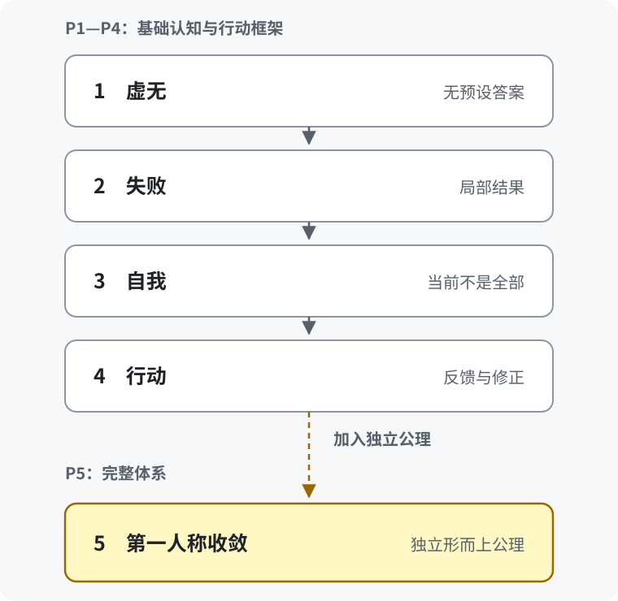

# 多恩可能性之圆｜认账，但不认命

> **一次失败是一次结果，不是整个人生的判决。**

有时，一次失利就会让人开始怀疑自己。“人生到底有什么意义”这个问题，也可能让人迟迟无法行动。

这个框架提供一种看法：承认已经发生的事实，也给尚未发生的人生留下空间。

它不保证愿望成真，也不要求先相信一整套哲学。可以先用最简单的行动方法，再决定是否继续读下去。

## 30 秒看懂

> ✅ **基础工具：前四条可以直接使用，不需要先接受任何分支假设。**

1. **意义可以自己选择。** 人生没有一份天生写好的标准答案。陪伴家人、做好工作、创造作品，都可以成为认真生活的理由。
2. **失败只说明这一次。** 考试没过、求职被拒、项目亏损，都需要认清原因和代价，但一次结果不能概括整个人生。
3. **此刻的自己不是全部。** 今天的状态只是人生的一张截图。过去积累的能力和未来仍可改变的部分，也属于更完整的自己。
4. **行动可以从小开始，再靠反馈修正。** 确定方向，迈出一小步，观察结果，然后继续、修改、暂停或结束。

> ✨ **可选的第五点：** 只要方向仍有现实可能，人也持续行动、学习和修正，未来的自己终会回头确认：“我做到了。”

不接受第五点，也可以完整使用前四条。文档把四条基础观点和这个可选观点统称为“五个核心命题”；第一次阅读不用记住这个名称。

## 5 分钟快速上手

不用先学术语，拿一件正在困扰自己的事，写下四行：

1. 我真正想靠近的方向是什么？
2. 今天能完成的最小一步是什么？
3. 哪些是已经确认的事实，哪些只是担心或猜测？
4. 做完以后，我要根据什么决定继续、修改、暂停或结束？

例如，求职被拒后，先确认具体反馈，再修改一版简历并投递两个匹配岗位。下一轮结果用来判断方法，不用来给整个人下结论。

需要完整模板时，直接打开[《5 分钟行动卡》](docs/zh-CN/PRACTICE.md)。

---

## 按需要选择阅读

- **现在就想行动：** [5 分钟行动卡](docs/zh-CN/PRACTICE.md)
- **零基础理解：** [A 版大众导读](docs/zh-CN/README.md)
- **快速复述观点：** [十二条核心主张](MANIFESTO.md)
- **查一个陌生词：** [分级术语表](docs/zh-CN/GLOSSARY.md)
- **想看看这套理论有没有漏洞：**
  - 先读 [B 版技术手册](docs/zh-CN/TECHNICAL.md)
  - 再查[符号化参考](docs/zh-CN/FORMAL_SPEC.md)
  - 最后看[未决问题与反对意见](docs/zh-CN/CRITICISM.md)
- **按问题查询：** [常见问题](docs/zh-CN/FAQ.md) · [心理与现实护栏](docs/zh-CN/WELLBEING.md)

第一次阅读只看行动卡或 A 版即可。遇到陌生术语可以跳过，也可以随时查术语表；B 版专门留给希望检验公理和形式结构的读者。

  

如果只想使用行动工具，读到这里就够了。如果还想了解这个框架怎样看待“我是谁”，下面是两套不同的观察方法。

## 两套模型分别做什么

前面提到的**五个核心命题**用来处理意义、失败、自我否定和行动。其中前四个是基础工具，第五个是可选观点。

**五层自我模型**用来从五个角度理解“我是谁”，适合想继续深挖自我的读者：

1. **能行动的我（身体自我）：** 身体真正执行行动，也承担疲劳、金钱和风险。
2. **正在体验的我（表象自我）：** 此刻的感受、记忆和自我评价。
3. **跨越时间与可能路线的我（分支集体自我）：** 不只看今天，还把过去和未来可能成为的自己放在一起。
4. **仍然选择在乎的我（虚无精神自我）：** 即使没有统一答案，仍决定认真对待一些事。
5. **承载一切的背景（虚无本身自我）：** 像一座舞台。故事可能成功，也可能失败，但舞台本身不会给任何一场戏判输赢。

两套模型解决的问题不同，不需要硬把每一层配给一个命题。需要严谨定义时，再进入 [B 版技术手册](docs/zh-CN/TECHNICAL.md)。

可选：查看五个命题的关系图

  

如果你好奇技术名称，B 版把第五点称为“第一人称分支收敛公理”。它是可以跳过的哲学假设，不是前四点推导出的结论。

## 一点温和的现实提醒

> ⚠️ 相信一个方向值得坚持，不代表可以忽略现实条件。

想要康复，仍要接受检查并遵从专业医嘱。追求事业，也要尊重法律、合同、现金流和他人的明确边界。

这个框架可以帮助整理心态与下一步，不能代替医疗、法律、财务或安全判断。更多说明见[心理与现实护栏](docs/zh-CN/WELLBEING.md)。

---

## 语言与开放许可

- [简体中文](README.md) · [繁體中文](docs/zh-TW/README.md) · [English](docs/en/README.md)
- [한국어](docs/ko/README.md) · [日本語](docs/ja/README.md) · [Tiếng Việt](docs/vi/README.md)
- [Français](docs/fr/README.md) · [Italiano](docs/it/README.md) · [Deutsch](docs/de/README.md) · [Русский](docs/ru/README.md)

> 翻译状态：简体中文是当前基准。其他语言版本还没更新到这一版，部分说法和术语可能不同。欢迎按[翻译流程](CONTRIBUTING.md#翻译流程)参与更新。

任何人都可以理解、使用、修改、批评或拒绝这个框架。文字采用 [CC BY-SA 4.0](LICENSE) 许可；转载、翻译和改写需署名，并以相同许可开放。

作者：多恩 / touen
