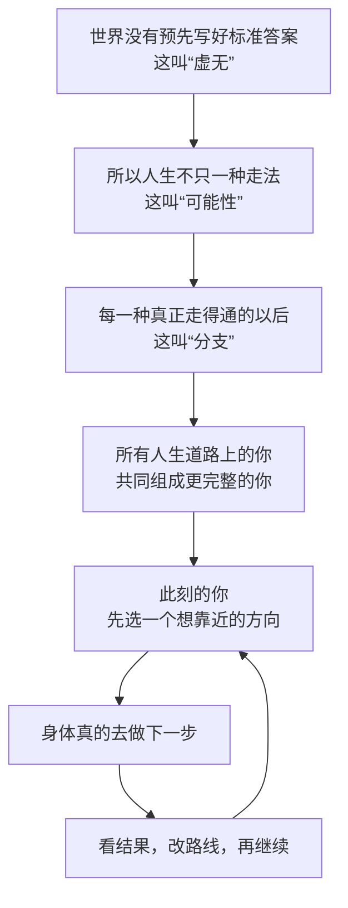

  

# 多恩可能性之圆

> **人生没有标准答案，不等于你不能好好作答。**
>
> **世界没有终极意义，也不等于你不能活得痛快。**

这是一套从虚无主义出发，回答“我是谁”，并帮助人走向一切真正可能成就的完整思想体系。

先别急着理解“虚无”“分支”“第一人称收敛”这些词。我们先讲一件谁都见过的东西：**一张白纸。**

白纸没有提前规定你必须画一棵树，还是画一座房子。

这不代表什么都不能画。恰恰相反，正因为没有规定，你才可以拿起笔，决定画什么。

《多恩可能性之圆》最重要的起点就是：

> **世界没有替你写好为什么活，不等于世界命令你不要活、不要爱、不要创造、不要成功。**

## 读完它，你能得到什么

- **不再害怕“人生可能没有意义”**：有没有宇宙级的答案，不再决定你今天能不能好好生活。
- **不再把一次失败当成人生判决书**：事情没做好，可以重来、换方法、换方向，但不必因此否定整个自己。
- **更敢追求大的目标**：只要一件事仍然做得到，就值得一边行动、一边学习、一边改路。
- **更清楚“我到底是谁”**：你不只是今天这一刻的自己，还包括一路走来的自己、将来的自己，以及所有本来可能成为的自己。
- **把豁达变成行动力**：不怕失败的人，往往更敢迈出下一步；肯迈步的人，才有机会改变结果。

用一句话说：

> **失败可以是真的，但它不是最后一句话；目标可以很远，但今天这一步必须真的走。**

## 作者已经得到的初步验证

这套体系首先在作者多恩（touen）本人身上运行。

它带来的变化不是“每天告诉自己要乐观”，而是更深的一种稳定：

- 可以接受人生也许没有终极意义，却不觉得天塌了；
- 可以面对失败，却不再害怕自己被一次失败彻底否定；
- 可以选择很大的目标，同时愿意承担现实中的代价和结果；
- 可以更豁达、更自由，也更愿意持续行动；
- 可以把“什么都无所谓”从放弃的理由，变成“那我认真生活也完全可以”的底气。

至少对作者本人来说，它已经不只是一套写在纸上的道理，而是一套能够实际运行的生活方法。

这属于一个人的真实实践结果，还不是面向所有人的大规模科学实验。公开它，就是邀请更多人一起理解、使用、批评和检验。

## 先用三个比喻讲懂整套体系

### 比喻一：没有标准答案的白纸

白纸没有规定你必须画什么，就像世界没有规定你必须为什么活。

你画了一朵花，白纸不会说：“不行，宇宙没有批准。”

你什么都不画，也可以；你认真画一幅大画，也可以。

这种“没有预先规定任何答案”的背景，正式名称叫作**虚无**。

这里的虚无不是“什么都不存在”，而是：

> **无论你做什么，都没有一份从宇宙外面寄来的标准答案替你打最终分数。**

### 比喻二：不断出现岔路的人生

想象你正在走一条路。

前面出现一个岔路口。向左和向右，会看到不同的人、遇到不同的事，也会变成不太一样的自己。

每一种真正走得通的走法，都可以叫作一条**人生岔路**。它的正式名称是**分支**。

所以，“分支”并不神秘。它只是：

> **从同一个岔路口出发，后来可能出现的不同人生。**

“可能性”负责回答：**有没有这条路？**

“概率”负责回答：**这条路有多容易走到？**

想得出来，不等于真的走得通。比如，人可以想象自己下一秒变成一块石头，但“能想象”本身不能证明这条路真的存在。

### 比喻三：装着所有草稿的画册

假设你画同一幅画，先后留下很多草稿：

- 有一张画得很成功；
- 有一张画错了；
- 有一张中途改了主题；
- 还有许多本来可能画出来、最后没有成为眼前成品的版本。

眼前这一张，不等于整本画册。

同样，此刻的你，也不一定等于完整的你。

《多恩可能性之圆》把过去的你、现在的你、将来的你，以及不同人生岔路上可能出现的你，放进同一本“人生画册”里。

这本完整画册，正式名称叫作**分支集体自我**。

## 五层自我：还是用画画来说明

现在把“我是谁”拆成五层：

1. **握笔的手——身体自我**：真正吃饭、走路、工作、受伤、行动并承担结果的你。

2. **正在看这一笔的人——表象自我**：此刻正在读这句话、感受世界，并且说“这是我”的你。

3. **整本画册里的你——分支集体自我**：过去、现在、将来，以及各种可能人生中的所有你。

4. **没有标准答案也愿意继续画的那股劲——虚无精神自我**：即使人生没有终极意义，仍然愿意选择、在乎、创造和前进。

5. **不替任何画规定最终分数的整张白纸——虚无本身自我**：画成功、画失败、画满或留白，都不会让它突然出现一份宇宙标准答案。

这五层不是五个藏在身体里的灵魂。

它们更像是在回答五个不同的问题：

- 谁在现实中动手？
- 谁在体验此刻？
- 完整的我包括哪些人生？
- 什么让我在没有终极意义时仍愿意前进？
- 所有存在背后，那个不规定标准答案的背景是什么？

## 它怎样帮助人实现成就

假设你想去一座很远的城市。

你不必在出门前记住沿途每一个路口。你只需要确认大方向，然后：

1. 先走眼前能走的一段；
2. 看路牌，确认有没有走偏；
3. 走错了就改，不把一次走错当成“永远到不了”；
4. 学会使用新的工具，也愿意向别人问路；
5. 只要目的地仍然去得了，就继续靠近。

这就是《可能性之圆》的现实行动方法：

> **方向负责告诉你往哪走，身体负责真的迈步，结果负责提醒你怎样改路。**

每一次有效行动，都可能让目标更容易实现；每一次认真复盘，都可能让你少走一段弯路。

它不能保证你坐在原地就得到一切。它能做的是：让你不再因为“也许没有意义”或“一次失败”过早放弃一件本来做得到的事。

## 最大胆的主张：一直走，最终走到

本体系还有一条最强、也最有争议的基本信念：

> **只要一个目标仍然做得到，你一直朝它前进，也愿意根据现实改路，那么此刻正在体验人生的这个“我”，最终会走进一个由将来的自己确认“我真的做到了”的人生。**

正式名称叫作**第一人称分支收敛**。

把词拆开就不难：

- **第一人称**：此刻正在看、正在想、正在作决定的这个我；
- **分支**：从人生岔路口走出去后，可能出现的不同人生；
- **收敛**：边走边改，但大方向越来越接近目标。

这条主张不是现代物理已经证明的事实。它是这套体系主动选择的一条基本公理。

它负责给人终极方向感；现实中的行动、反馈和责任，负责防止这份信念变成空想。

## 这套体系真正大胆在哪里

许多理论分别讨论过虚无、人生选择、自我、平行世界或行动。

《多恩可能性之圆》的不同之处，是把下面这些问题放进同一张图里：

- 世界没有标准答案，人为什么仍然可以认真生活；
- 人生有很多走法，这些走法和概率是什么关系；
- 今天的我、过去的我、将来的我和其他可能的我，怎样共同组成一个更大的我；
- 人怎样在接受失败的同时，仍然相信目标最终可以实现；
- 强大的信念怎样与身体行动、现实反馈、法律、责任和他人同意同时成立。

就本项目目前对既有理论的整理来看，还没有发现第二套成熟体系把这五部分以同样方式完整接在一起。

它的正式名称是：

> **概率—虚无—分支集体自我论。**

名称可以很长，意思却可以很简单：

> **世界没有替你规定答案；人生不只一条路；你也不只眼前这一个点；只要路还在，就认真地走。**

## 一张图看懂

## 从哪里开始

- **想用五分钟听懂**：[打开白话快速入门](docs/zh-CN/QUICKSTART.md)
- **想从头到尾弄明白**：[阅读白话完整导读](docs/zh-CN/README.md)
- **想看最有力量的十二句话**：[阅读《可能性之圆》十二条](MANIFESTO.md)
- **想确认它有没有偷换概念**：[阅读最强反对意见与边界](docs/zh-CN/CRITICISM.md)
- **想检查精确定义**：[查看形式化说明](docs/zh-CN/FORMAL_SPEC.md)
- **更喜欢听故事**：[阅读八个虚构案例](docs/zh-CN/EXAMPLES.md)

更多入口：[常见问题](docs/zh-CN/FAQ.md) · [术语的人话解释](docs/zh-CN/GLOSSARY.md) · [心理与现实护栏](docs/zh-CN/WELLBEING.md)

## 无论相信多少，都必须守住现实

这套体系不能拿来证明：

- 不行动也能自动成功；
- 生病可以不看医生；
- 冒险不用计算代价；
- 法律、金钱和现实后果可以忽略；
- “另一个人生里的你同意了”，所以可以不尊重眼前这个人的意见；
- 只要想象得到，一件事就一定做得到。

这里说的“绝对自洽”，是指它在自己公开说明的基本前提里面能够前后接得上；不等于每一条前提都已经被科学实验确认。

真正强大的信念，不是闭上眼睛说“我一定赢”，而是睁着眼睛看清现实之后，仍然敢走下一步。

## 选择语言

[简体中文](docs/zh-CN/README.md) · [繁體中文](docs/zh-TW/README.md) · [English](docs/en/README.md) · [한국어](docs/ko/README.md) · [日本語](docs/ja/README.md) · [Français](docs/fr/README.md) · [Italiano](docs/it/README.md) · [Deutsch](docs/de/README.md) · [Русский](docs/ru/README.md) · [Tiếng Việt](docs/vi/README.md)

## 开放方式

这是一个可以被理解、使用、修改、批评或拒绝的开放哲学体系。

文字采用 [CC BY-SA 4.0](LICENSE) 许可。你可以转载、翻译和改写，但需要署名，并以相同许可开放改写后的作品。

如果只把它讲给别人听一句，请说：

> **没有标准答案，不等于不能好好作答；没有终极意义，不等于不能活得精彩。**

作者：**多恩 / touen**
