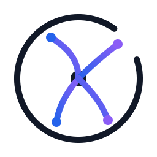
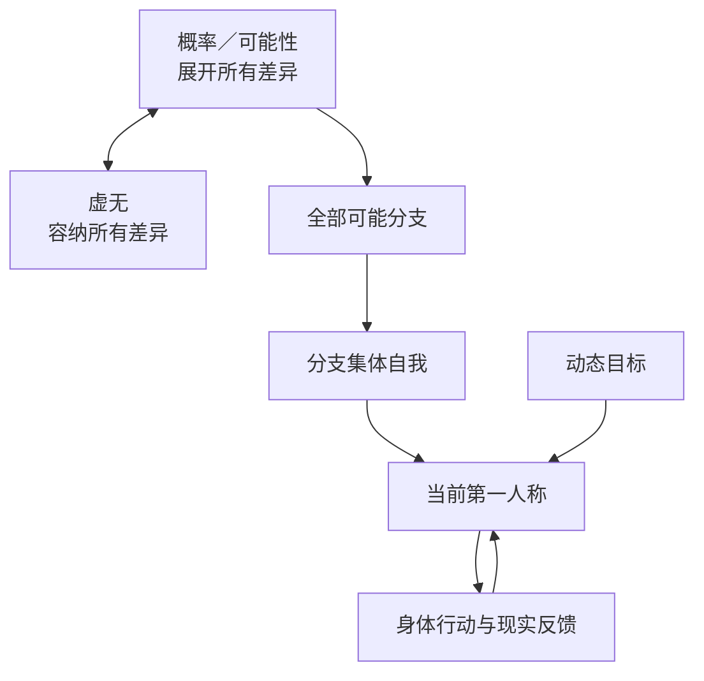

# 多恩可能性之圆

> **没有终极意义，也可以活得精彩。**

  

《多恩可能性之圆》（正文简称《可能性之圆》）是多恩（touen）提出的**概率—虚无—分支集体自我框架**。它不尝试替世界编造一个终极目的，而是追问：

> 如果一切终究没有预设意义，为什么“认真生活”不能也是无所谓所容纳的一种可能？

框架明确采用“世界没有预设的终极意义”作为哲学公理；这不是自然科学已经完成的实验结论。

## 选择语言

| 语言 | 入口 |
| --- | --- |
| 🇨🇳 简体中文（默认） | [开始阅读](docs/zh-CN/README.md) |
| 🇨🇳 繁體中文 | [開始閱讀](docs/zh-TW/README.md) |
| 🇺🇸 English | [Start reading](docs/en/README.md) |
| 🇰🇷 한국어 | [읽기 시작](docs/ko/README.md) |
| 🇯🇵 日本語 | [読み始める](docs/ja/README.md) |
| 🇫🇷 Français | [Commencer la lecture](docs/fr/README.md) |
| 🇮🇹 Italiano | [Inizia a leggere](docs/it/README.md) |
| 🇩🇪 Deutsch | [Lesen](docs/de/README.md) |
| 🇷🇺 Русский | [Начать чтение](docs/ru/README.md) |
| 🇻🇳 Tiếng Việt | [Bắt đầu đọc](docs/vi/README.md) |

## 用一分钟理解

想象一本会不断分叉的故事书。

- 你现在读到的这一页，是**表象自我**正在经历的局部世界。
- 拿着书、真正行动并承担结果的，是**身体自我**。
- 所有可能版本的主角共同组成**分支集体自我**。
- “即使一切无所谓，也仍然可以认真选择”的运行方式，是**虚无精神自我**。
- 无论故事写了什么，都不因任何存在而被推翻的背景，是**虚无本身自我**。
- 让故事出现不同分支的是**概率／可能性**；它与虚无同级、作用不同而相容：一个展开差异，一个容纳差异。

这个框架再加入一项明确的形而上公理：

> 只要目标仍具有可能性，主体以它为方向持续前进，第一人称最终必然显现于一个由未来自我确认“已经实现”的分支。

目标不是一张从一开始就完全清楚的照片。认知会成长，路线、目标乃至更高层方向都可以诚实更新；收敛公理针对主体更新后仍认可并持续趋近的目标成立。

最短记忆法是：**一圆、两原则、五层自我、一条收敛公理、一条现实底线。**

- **一圆**：所有真正可能的状态都在某个分支或非时间方式中实现。
- **两原则**：可能性展开差异，虚无容纳差异。
- **五层自我**：身体、表象、分支集体、虚无精神、虚无本身。
- **一条收敛公理**：仍可能、持续行动、未来自我确认，三个条件缺一不可。
- **一条现实底线**：形而上确定感永远不能取消事实、责任、同意和局部后果。

## 核心结构

## 它不是在说什么

- 它不是量子力学、多世界解释或庞加莱回归已经证明的物理定律。
- 它不主张“只要想象，现实就会自动改变”。
- 它不取消法律、健康、金钱、他人同意和局部世界中的真实后果。
- 它不要求读者相信作者的私人经历；本仓库不收录任何私人原始材料。

这是一个可以被接受、修改、批评或拒绝的哲学框架。项目会把**体验陈述、实践方法、形而上公理和科学事实**清楚分开。

## 阅读路线

- **5 分钟**：[快速入门](docs/zh-CN/QUICKSTART.md)
- **1 页宣言**：[《可能性之圆》十二条](MANIFESTO.md)
- **30 分钟**：[费曼式完整导读](docs/zh-CN/README.md)
- **精确定义**：[形式化说明](docs/zh-CN/FORMAL_SPEC.md)
- **虚构案例**：[用故事理解框架](docs/zh-CN/EXAMPLES.md)
- **最强质疑**：[反对意见与边界](docs/zh-CN/CRITICISM.md)
- **常见问题**：[FAQ](docs/zh-CN/FAQ.md)
- **术语表**：[核心概念](docs/zh-CN/GLOSSARY.md)
- **阅读安全**：[心理与现实护栏](docs/zh-CN/WELLBEING.md)

## 开放方式

欢迎提交解释改进、反对意见、翻译和新的虚构案例。贡献前请阅读 [贡献指南](CONTRIBUTING.md) 与 [隐私规则](PRIVACY.md)。

文字内容采用 [CC BY-SA 4.0](LICENSE) 许可。你可以转载、翻译和改编，但需要署名，并以相同许可开放衍生作品。

作者：**多恩 / touen**
