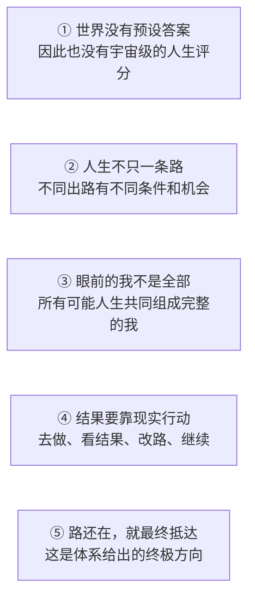

  

# 多恩可能性之圆

## 如果人生没有终极意义，你反而自由了

林小满十七岁那年，在手机上看见了“未被录取”。

她把手机扣在饭桌上，说了一句：

> “别问了。我就是不行。”

八十六岁的外公没有劝她“下次一定成功”。

他只是拿出一本旧相册，翻到自己四十六岁失业的那一页：

> “丢工作是真的，难受也是真的。”
>
> “可这一页，没资格冒充整本书。”

许多故事会在失败那里结束。

《多恩可能性之圆》偏要从那里开始。

因为有一句话，值得重新问一遍：

> **世界从未规定什么才叫“正确人生”。一次失败，又凭什么替你写完整个人生的结局？**

[继续读完这个五分钟故事 →](docs/zh-CN/QUICKSTART.md)

这不是一碗“凡事都有意义”的安慰。

它是一套从虚无出发的完整思想框架。

它要回答四件事：我是谁，为什么活，怎样面对失败，又怎样真正走向成就。

它最强的主张也不躲在后面：

> **目标确实还有路。你也一直在行动、学习、改路。**
>
> **只要这些条件始终成立，本体系认为：你亲身经历的人生，最终必然走向由未来的自己确认“我做到了”的结果。**

这是一套哲学体系，不是自然科学提案。

判断它，不必等实验室盖章。

只需要看三件事：出发点有没有公开，前后逻辑能不能接上，落到现实生活时会不会自相矛盾。

先别背任何名词。

我们从每个人都走过的路讲起。

## 读下去，你会拿到什么

- **面对虚无的豁达**：不必假装万事自有安排，也不再因“也许没有意义”而恐慌。
- **面对失败的底气**：承认损失、承担后果，却不让一次结果定义完整的自己。
- **走向目标的方法**：选方向、走一步、看结果、改路线，让现实中还能走的路越来越清楚。
- **一个更大的“自我”答案**：你不只是眼前这个输过或赢过的人，还包括一路走来的你，以及各种真正可能人生里的你。

所谓“无穷可能性”，指的是这套体系所容纳的整个可能性空间，不是说某个人在任何时候都能做成任何事。

刚开始读时，可以先把“不同道路”理解成现实中的不同出路。

深入部分还会讨论所有真正可能的人生。无论读到哪一层，都不能把它理解成“什么都不做，让另一个世界的自己替我成功”。

它真正要夺回的，是这句话：

> **有些路会永久关闭，但这不等于所有路都已经关闭。**

而这，只是第一层反转。

## 第一章：世界沉默，不等于世界判你失败

很多人听到“人生也许没有终极意义”，会立刻接上后半句：

> “那还努力什么？”

可这两句话根本不是一回事。

一条路没有替你决定目的地，不等于它命令你站着别动。

世界没有标准答案，意味着没有哪一种活法天生得到宇宙批准，也没有哪一次失败能被宇宙盖章为“永远翻不了身”。

你可以爱一个人，可以写一本书，可以照顾家人，可以创业，可以休息，也可以重新开始。

这些选择不需要先拿到“宇宙许可证”。

本体系把这种“世界没有预先写好终极答案”的背景叫作**虚无**。

虚无不是说眼前的一切都不存在。

它只是说：

> **世界没有替你规定活着的理由。**

过去，这句话也许让人害怕。

现在，请把它的另一面也读出来：

> **世界同样没有替你规定，你注定失败。**

## 第二章：失败不是判决书，只是一份路况报告

想象你要去一座很远的城市。

你走进一条死路，当然是真的走错了。你可能浪费时间、花掉钱，甚至错过一班再也赶不上的车。

这套体系从不要求你把损失说成“都是最好的安排”。

它只追问一件事：

> **这条路走不通，能不能直接证明所有路都走不通？**

不能。

它最多证明：

> 按照刚才的走法，在刚才的条件下，这一步没有到达你想去的地方。

于是，失败第一次失去了“终审权”。

它仍然是一件真实发生的事，却不再是一张贴在你身上的永久标签。

接下来只做四件事：

1. 承认结果，不骗自己；
2. 找出哪里走不通；
3. 换一种现实中能做的走法；
4. 再走一步。

这不是一句宽慰人的话。

“只要相信就会成功”是在逃避现实；这里说的是：

> **相信的作用，是让你肯继续找路；真正改变结果的，永远是行动、反馈和修正。**

可新的问题来了：

如果昨天的你失败了，今天的你改变了，十年后的你甚至认不出今天的自己——这些人，究竟是不是同一个“我”？

## 第三章：眼前的你，只是整本书的一页

拿出一本旧相册。

第一张照片里的你不会走路，另一张里的你正在上学。再往后，你也许换过工作、爱过人、告别过人，还做过一些如今绝不会再做的决定。

每一页都不一样。

但你不会指着其中一次狼狈，说：

> “这一页，就是整本书。”

眼前的你也是一样。

今天正在读这句话的你，只是人生刚刚翻到的一页，不是整本人生。

人其实早就在为“尚未出现的自己”生活：为了明年的自己学习，为了年老的自己存钱，为了病好后的自己按时吃药。

那个未来的你还没有出现，却已经在影响今天的选择。

再想象一个岔路口。

往左走，你留在熟悉的城市；往右走，你去一个陌生的地方。两条路会让你遇见不同的人，学会不同的事，也变成不同的自己。

从同一个路口出发，选择不同，后来就会走出不同的人生。

精确文件把每一条不同的人生道路叫作“分支”。首页不需要记这个词。

这套体系在这里再向前走一步：

> **过去的你、现在的你、将来的你，以及所有真正可能的人生道路上与“你”相对应的版本，共同组成一个更完整的“我”。**

这句话是本体系对“完整的我”的定义。

它把那些真正可能、却没有出现在眼前生活里的版本，也算进更大的自我。

这不表示人能回到过去，也不表示随便想象的事情都会发生。

什么才算“真正可能”？不同人生里的谁还算“同一个人”？这些问题仍然可以继续讨论。

你可以不同意。

但不能再用某一页的输赢，假装自己已经读完了整本书。

## 第四章：真正改变命运的，是脚下这一步

路再多，不走，也只是地图。

目标再大，不能拆成今天的动作，也只是愿望。

这套体系的现实方法只有一个循环：

> **选一个方向 → 做眼前一步 → 看见真实结果 → 调整走法 → 再做一步。**

这里要分清两个容易混在一起的词：

- **可能性**问的是：现实中还有没有这条路？
- **概率**问的是：按照现在的条件，这条路有多容易走通？

概率低，不等于概率永远不变。

学会一项技能、找到一个可靠的伙伴、避开已经踩过的坑、承认原计划不行并及时换路，都可能改变下一步的概率。

你不能命令世界交出结果。

但你可以不断改变自己与结果之间的距离。

所以，这套从虚无出发的体系，最后没有把人带到“什么都别做”。

它把人带回了最具体的地方：

> **今天，你能为那个目标做哪一件真实的小事？**

做完以后，故事才有资格进入最重要的一章。

## 第五章：路没有断，就最终走到

先把两件事分清。

现实中的行动，会改变一部分机会。

而“最终会抵达”，是这套体系主动选择的基本出发点。

它需要两个条件一直成立：

1. 目标从现在出发，确实还有实现的路；
2. 你不是只在心里相信，而是在持续行动、学习，并根据结果改路。

只要这两个条件没有消失，本体系就给出最强的结论：

> **你亲身经历的人生，最终必然走上抵达目标的那条路。到了那里，由未来的你亲自确认：“我做到了。”**

换成日常的话就是：

> **路若还在，就边走边改，直到走到。**

这不是“躺着等另一个自己成功”，也不是用未来替代今天。

身体仍然要真的去做。

失败仍然要真的承担。

路线仍然要根据现实修改。

现实方法负责改变机会。

最终抵达的信念，负责给出方向。

只要把两者分清，这个主张就可以非常大胆，也不会变成空想。

## 这不是一条偷换出来的推理链

整套体系由五个基本出发点共同组成。

它不是从“人生没有意义”一句话里，凭空推出所有结论：

这张图刻意没有把每个方框画成“前一个自然证明后一个”。

所谓自洽，不是藏起前提制造神迹。

它是把每一个出发点、每一步作用和每一个待解问题都摆在桌面上，再看它们能不能同时成立。

前两块说明世界与道路，第三块回答“谁是我”，第四块负责现实行动，第五块单独给出终极方向。缺少任何一块，都不再是这套完整体系。

## 它为什么值得被称为一套完整体系

虚无主义并不新，讨论“我是谁”并不新，谈人生选择、可能世界和目标行动也都不新。

真正少见的是，把五个彼此拉扯的问题接进同一套框架：

1. 没有终极意义，人仍然可以认真生活；
2. 人生有不同走法，可能性与概率各有作用；
3. 眼前的我只是更大自我的局部；
4. 终极信念给方向，现实行动让结果发生；
5. 自由、责任、失败和成就，不必互相牺牲。

至少在本项目目前查到的公开思想体系中，还没有发现第二套框架，以同样方式把这五部分完整接在一起。

在精确文件中，它的正式名称是：

> **概率—虚无—分支集体自我论。**

这个名称用来方便严谨讨论，不是普通读者进入这套体系的门票。

名字很长，野心也确实很大：

> **它试图给“我是谁、为什么活、怎样面对失败、怎样走向成就”一个从虚无出发，却不会坠入绝望的终极回答。**

这不是封死人生的答案。

它要把整个可能性空间重新打开。

## 作者先把这套方法用在了自己身上

作者多恩（touen）先把这套方法放进了自己的长期选择、真实失败和必须亲自承担后果的生活里。

初步实践的结果，不是“从此事事顺利”。

作者可以接受人生也许没有终极意义，却不再恐慌。

他可以面对失败，却不再害怕被一次失败彻底定义。

他也可以选择很大的目标，同时愿意从最小的现实行动开始。

对作者本人而言，它带来的豁达没有削弱行动，反而让行动更坚定。

这是一份个人实践结果。

公开整个体系，就是把它交给更多读者理解、使用、质疑和检验它的逻辑。

## 从哪里继续

- **先读一个五分钟短篇**：[落榜那晚，外公给她看了一本旧相册](docs/zh-CN/QUICKSTART.md)
- **从头拆开完整论证**：[阅读白话完整导读](docs/zh-CN/README.md)
- **先看最有力量的十二句话**：[阅读《可能性之圆》十二条](MANIFESTO.md)
- **看看它能不能经住反驳**：[阅读最强反对意见与边界](docs/zh-CN/CRITICISM.md)
- **检查每个出发点与精确定义**：[查看形式化说明](docs/zh-CN/FORMAL_SPEC.md)
- **继续读不同人生的故事**：[阅读八个虚构案例](docs/zh-CN/EXAMPLES.md)

更多入口：[常见问题](docs/zh-CN/FAQ.md) · [术语的人话解释](docs/zh-CN/GLOSSARY.md) · [心理与现实护栏](docs/zh-CN/WELLBEING.md)

## 这套想法，要和现实一起使用

它不会抹掉现实的代价。

生病仍然需要治疗，冒险仍然要计算后果，法律与承诺仍然有效。

眼前的人没有同意，就是没有同意。

不能幻想另一个世界的自己，会替今天的你行动或承担责任。

这里说的“绝对自洽”，只有一个意思：接受它公开写明的出发点以后，整套逻辑能够前后接上。

它从来不等于“想象什么，什么就会发生”。

真正强大的信念，不是闭上眼睛说“我一定赢”。

而是睁着眼睛看清现实之后，仍然敢走下一步。

## 选择语言

[简体中文](docs/zh-CN/README.md) · [繁體中文](docs/zh-TW/README.md) · [English](docs/en/README.md) · [한국어](docs/ko/README.md) · [日本語](docs/ja/README.md) · [Français](docs/fr/README.md) · [Italiano](docs/it/README.md) · [Deutsch](docs/de/README.md) · [Русский](docs/ru/README.md) · [Tiếng Việt](docs/vi/README.md)

## 开放方式

这是一个可以被理解、使用、修改、批评或拒绝的开放哲学体系。

文字采用 [CC BY-SA 4.0](LICENSE) 许可。你可以转载、翻译和改写，但需要署名，并以相同许可开放改写后的作品。

如果只把它讲给别人听一句，请说：

> **世界没有替你写好意义，一次失败也没资格替你写完结局；只要路还在，故事就没有结束。**

作者：**多恩 / touen**
