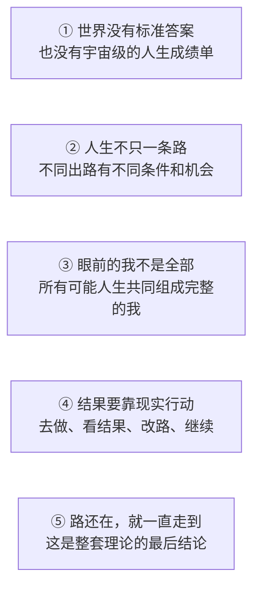

  

# 多恩可能性之圆

## 就算世界没有终极意义，也不影响你活得很牛逼

> **这套想法从“世界没有标准答案”出发，想把四件事说清楚：我是谁、为什么活、失败了怎么办、怎样把想做的事真正做成。**

《多恩可能性之圆》从一句很简单的话开始：

> **世界可能根本没替任何人安排好“为什么活”。**

它要处理的，不只是书本里的哲学问题。

它面对的是普通人每天都可能遇到的困境：

- 考试没过，于是怀疑自己是不是一辈子都不行；
- 求职被拒，于是觉得人生已经错过了机会；
- 创业亏损，于是把一次判断失误变成对整个人的否定；
- 一段关系结束，于是觉得过去和未来都失去了意义。

这些事情都可能很痛，也都可能带来真实损失。

但痛苦和损失之外，人经常又偷偷加上一句判决：

> **“这次没成，说明我这个人就是不行。”**

这套体系首先要拆掉的，就是这句多出来的判决。

> **失败是真的，但“你不行”未必是真的。一条路断了，也不等于所有路都断了。**

## 先把两件事分开

### 这些看法，不信平行宇宙也能用

这一层有四个观点：

1. 世界没有标准答案，也就没有一张宇宙发来的人生成绩单；
2. 一次失败只能说明这次没成，不能说明你这个人不行；
3. 现在的你不是全部，过去、现在和未来合起来，才是更完整的你；
4. 你今天怎么做，会改变明天还有哪些路可走。

只用这四点，已经能处理很多虚无感、失败感和自我怀疑。

### 如果接受整套理论，它还有一个更猛的结论

《多恩可能性之圆》还会再向前走一步。

先确认目标还可能做到。然后一直行动、学习，并根据结果改路。

只要这两件事没变，这套理论就直接下结论：

> **你亲身经历的人生，最后一定会走到目标那里。到了那一天，未来的你会亲口确认：“我做到了。”**

它不是在冒充科学定律。它是一套哲学体系。

要检查的不是实验室认不认可，而是三件事：前提有没有说清，前后能不能接上，整套说法会不会自己打架。

## 这套想法能帮你什么

- **不再被“人生没意义”吓住**：世界没有安排答案，不等于你不能认真生活。
- **不再让一次失败给自己判终身**：损失要认，后果要担，但不用顺手把整个人也否定掉。
- **知道接下来具体做什么**：先走一步，看结果，再决定继续、换路还是换目标。
- **不再把眼前的自己当成全部**：你还包括一路走来的自己，以及以后可能成为的自己。

这里说“可能性很多”，不是说一个人想要什么都能做到。

它只说：只要还有一条真能走通的路，就不要提前把所有门都关上。

后面还会谈到不同的可能人生。你可以先不接受这一层，但不能把它理解成“什么都不做，让另一个世界的自己替我成功”。

它真正要夺回的，是这句话：

> **有些路会永久关闭，但这不等于所有路都已经关闭。**

这四个结果不是彼此无关的人生建议。

它们来自同一套结构。

## 世界没给标准答案，不代表你不能认真活

很多人听到“人生也许没有终极意义”，会立刻接上后半句：

> “那还努力什么？”

可这两句话根本不是一回事。

一条路没有替你决定目的地，不等于它命令你站着别动。

世界没有给哪种活法盖上“唯一正确”的章，也没有给哪次失败盖上“永远翻不了身”的章。

你可以爱一个人，可以写一本书，可以照顾家人，可以创业，可以休息，也可以重新开始。

这些选择不需要先拿到“宇宙许可证”。

这里说的**虚无**，就是世界没提前写好答案。

虚无不是说眼前的一切都不存在。

它只是说：

> **世界没有替你规定活着的理由。**

过去，这句话也许让人害怕。

现在，请把它的另一面也读出来：

> **世界同样没有替你规定，你注定失败。**

## 一次失败，只能说明这一次没成

想象你要去一座很远的城市。

你走进一条死路，当然是真的走错了。你可能浪费时间、花掉钱，甚至错过一班再也赶不上的车。

这套体系从不要求你把损失说成“都是最好的安排”。

它只追问一件事：

> **这条路走不通，能不能直接证明所有路都走不通？**

不能。

它最多证明：

> 按照刚才的走法，在刚才的条件下，这一步没有到达你想去的地方。

于是，失败第一次失去了“终审权”。

它仍然是一件真实发生的事，却不再是一张贴在你身上的永久标签。

放进生活里看，会更清楚：

- 考试没过，说明这次成绩没有达到要求；
- 求职被拒，说明这次匹配没有成功；
- 创业亏损，说明这套做法在当时没有跑通；
- 一段关系结束，说明这段关系无法继续。

这些结果都是真的。

但它们没有一条能够直接推出：“我这个人从此没有可能。”

接下来只做四件事：

1. 承认结果，不骗自己；
2. 找出哪里走不通；
3. 换一种现实中能做的走法；
4. 再走一步。

这不是一句宽慰人的话。

“只要相信就会成功”是在逃避现实；这里说的是：

> **相信的作用，是让你肯继续找路；真正改变结果的，永远是行动、反馈和修正。**

可新的问题来了：

如果昨天的你失败了，今天的你改变了，十年后的你甚至认不出今天的自己——这些人，究竟是不是同一个“我”？

## 现在的你，不等于完整的你

拿出一本旧相册。

第一张照片里的你不会走路，另一张里的你正在上学。再往后，你也许换过工作、爱过人、告别过人，还做过一些如今绝不会再做的决定。

每一页都不一样。

但你不会指着其中一次狼狈，说：

> “这一页，就是整本书。”

眼前的你也是一样。

今天正在读这句话的你，只是人生刚刚翻到的一页，不是整本人生。

人其实早就在为“尚未出现的自己”生活：为了明年的自己学习，为了年老的自己存钱，为了病好后的自己按时吃药。

那个未来的你还没有出现，却已经在影响今天的选择。

再想象一个岔路口。

往左走，你留在熟悉的城市；往右走，你去一个陌生的地方。两条路会让你遇见不同的人，学会不同的事，也变成不同的自己。

从同一个路口出发，选择不同，后来就会走出不同的人生。

后面的严谨文档把每一条不同的人生道路叫作“分支”。首页不用记这个词。

这套体系还会再往前走一步：

> **“我”不只是现在这一刻。过去的你、现在的你、未来的你，再加上所有可能人生里的你，合起来才是更完整的你。**

这就是它所说的“完整的我”。

有些人生没有成为你眼前的生活。但只要它真的可能，这套理论也把那里的“你”算进完整的你。

这不表示人能回到过去，也不表示随便想象的事情都会发生。

什么才算“真正可能”？不同人生里的谁还算“同一个人”？这些问题仍然可以继续讨论。

你可以不同意。

但不能再用某一页的输赢，假装自己已经读完了整本书。

## 真正改变结果的，是你接下来怎么做

路再多，不走，也只是地图。

目标再大，不能拆成今天的动作，也只是愿望。

落到现实里，方法只有五步：

> **选一个方向 → 做眼前一步 → 看见真实结果 → 调整走法 → 再做一步。**

这里要分清两个容易混在一起的词：

- **可能性**问的是：现实中还有没有这条路？
- **概率**问的是：按照现在的条件，这条路有多容易走通？

概率低，不等于概率永远不变。

学会一项技能、找到一个可靠的伙伴、避开已经踩过的坑、承认原计划不行并及时换路，都可能改变下一步的概率。

你不能命令世界马上给你结果。

但你可以让下一次更接近结果。

面对失败时，两种问法会把人带向完全不同的方向：

- **旧问题**：“这是不是证明我不行？”
- **新问题**：“这次到底哪里没走通？我还能改变哪个条件？”

所以，这套从虚无出发的理论，最后没有把人带到“什么都别做”。

它把人带回了最具体的地方：

> **今天，你能为那个目标做哪一件真实的小事？**

## 只要路还在，就一直走到

先把两件事说清楚。

行动会改变机会，但“最后一定走到”不是从概率里算出来的。

它是这套理论自己选的一条前提。

它需要两个条件一直成立：

1. 这件事从现在开始，确实还有可能做到；
2. 你不是只在心里相信，而是在持续行动、学习，并根据结果改路。

只要这两个条件没有消失，这套理论就直接下结论：

> **你最后一定会走到目标那里。到了那一天，未来的你会亲口确认：“我做到了。”**

换成日常的话就是：

> **路若还在，就边走边改，直到走到。**

这不是“躺着等另一个自己成功”，也不是用未来替代今天。

身体仍然要真的去做。

失败仍然要真的承担。

路线仍然要根据现实修改。

行动负责把路走出来。

“最后一定走到”的信念，负责让你在还有路时，不提前认输。

把这两件事分清，它就不是一句空想。

## 这五件事，到底是怎么接上的

这套理论不是从“人生没有意义”一句话里，硬推出后面的所有结论。

它需要五个出发点一起成立：

这张图没有假装“前一句能自动证明后一句”。

所谓“说得通”，不是把漏洞藏起来。

它要把每个出发点、每一步作用和每个还没回答的问题都摆出来，再看它们能不能同时成立。

前两块说世界和道路，第三块说谁算“我”，第四块说今天怎么做，第五块说最后会走到哪里。

少掉任何一块，这套话就接不完整。

## 它为什么不只是几句零散的鸡汤

虚无主义并不新，讨论“我是谁”并不新，谈人生选择、可能世界和目标行动也都不新。

真正少见的是，用同一套说法同时回答五个很难的问题：

1. 世界没有终极意义，人为什么还能认真生活；
2. 人生有很多条路，为什么有些好走、有些难走；
3. 现在的我，为什么不是完整的我；
4. 相信最后能做到，为什么不能代替今天动手去做；
5. 人怎样既保持自由，又承担责任，还不被失败压垮。

至少在本项目目前查到的公开思想体系中，还没有发现第二套框架，以同样方式把这五部分完整接在一起。

在后面的严谨文档中，它有一个正式名称：

> **概率—虚无—分支集体自我论。**

这个名称只是方便深入讨论，不是读懂这套想法的门票。

名字很长，野心也确实很大：

> **它想把四个问题一次说清：我是谁，为什么活，失败了怎么办，想做的事怎样做成。哪怕世界没有终极意义，这套回答也不会把人推向绝望。**

这不是封死人生的答案。

它要把整个可能性空间重新打开。

## 作者先把这套方法用在了自己身上

作者多恩（touen）先把这套方法放进了自己的长期选择、真实失败和必须亲自承担后果的生活里。

初步实践的结果，不是“从此事事顺利”。

作者可以接受人生也许没有终极意义，却不再恐慌。

他可以面对失败，却不再害怕被一次失败彻底定义。

他也可以选择很大的目标，同时愿意从最小的现实行动开始。

对作者本人而言，它带来的豁达没有削弱行动，反而让行动更坚定。

这是一份个人实践结果。

把它公开出来，就是让更多人使用、质疑，看看这套逻辑到底能不能站住。

## 五句话记住整套体系

1. **没有终极意义，不等于不能认真生活。**
2. **失败可以是事实，但失败不是身份。**
3. **眼前的你是一部分，不是完整的你。**
4. **有没有路，和这条路好不好走，是两回事。**
5. **只要这件事还有可能做到，你也一直在做、一直在改，最后就会走到。**

## 如果你想继续往下看

- **从头拆开完整论证**：[阅读白话完整导读](docs/zh-CN/README.md)
- **先看最有力量的十二句话**：[阅读《可能性之圆》十二条](MANIFESTO.md)
- **看看它能不能经住反驳**：[阅读最强反对意见与边界](docs/zh-CN/CRITICISM.md)
- **检查每个出发点与精确定义**：[查看形式化说明](docs/zh-CN/FORMAL_SPEC.md)

更多入口：[常见问题](docs/zh-CN/FAQ.md) · [术语的人话解释](docs/zh-CN/GLOSSARY.md) · [心理与现实护栏](docs/zh-CN/WELLBEING.md)

## 别拿这套理论逃避现实

它不会抹掉现实的代价。

生病仍然需要治疗，冒险仍然要计算后果，法律与承诺仍然有效。

眼前的人没有同意，就是没有同意。

不能幻想另一个世界的自己，会替今天的你行动或承担责任。

这里说“绝对自洽”，不是“作者说什么都对”。

它的意思很简单：接受前面写清楚的出发点以后，后面的说法不能互相打架。

它从来不等于“想象什么，什么就会发生”。

真正强大的信念，不是闭上眼睛说“我一定赢”。

而是睁着眼睛看清现实之后，仍然敢走下一步。

## 选择语言

[简体中文](docs/zh-CN/README.md) · [繁體中文](docs/zh-TW/README.md) · [English](docs/en/README.md) · [한국어](docs/ko/README.md) · [日本語](docs/ja/README.md) · [Français](docs/fr/README.md) · [Italiano](docs/it/README.md) · [Deutsch](docs/de/README.md) · [Русский](docs/ru/README.md) · [Tiếng Việt](docs/vi/README.md)

## 开放方式

这是一个可以被理解、使用、修改、批评或拒绝的开放哲学体系。

文字采用 [CC BY-SA 4.0](LICENSE) 许可。你可以转载、翻译和改写，但需要署名，并以相同许可开放改写后的作品。

如果只把它讲给别人听一句，请说：

> **就算世界没有终极意义，也不影响你活得很牛逼。失败不能给你定终身；路还没断，就继续走，直到走到。**

作者：**多恩 / touen**
