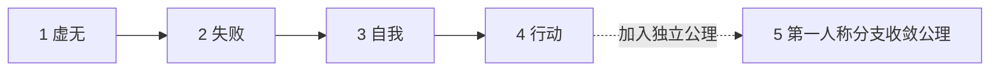

  

# 多恩可能性之圆

## 没有终极意义，也可以活得精彩

《多恩可能性之圆》是一套讨论虚无、失败、自我与行动的开放哲学框架。正式名称是“概率—虚无—分支集体自我框架”。

## 200 字以内：最小可用版

世界没有预设的终极意义，不等于人不能选择在乎什么。一次失败需要认清结果、原因和代价，但它不能单独定义整个人生。面对仍值得且可能的目标，采用“确定方向—采取行动—观察反馈—修正方法”的循环。这部分不要求接受分支理论。完整体系另采用第一人称分支收敛公理（A6）。

> **认账，但不认命。**

## 阅读契约

本文把定义、逻辑判断、体验模型、实践方法、哲学公理和现实边界分开标注。《可能性之圆》不是自然科学理论；它的形而上主张应按公理体系阅读，不能替代经验预测、专业判断或现实责任。

## 五个核心命题

| 编号 | 锚定名称 | 类型 | 最短表述 |
| --- | --- | --- | --- |
| 1 | 虚无与局部价值 | 哲学公理／本体论公理 | 没有预设的终极意义，不等于局部选择被禁止 |
| 2 | 失败的局部性 | 逻辑判断 | 失败是一次真实结果，不是对完整主体的终审判决 |
| 3 | 当前自我与分支集体自我 | 体验模型／身份公理与集合定义 | 此刻的表象自我不是完整主体；完整体系把历时与可能分支实例纳入分支集体自我 |
| 4 | 行动与反馈循环 | 实践方法 | 用行动改变条件，用反馈修正方法与目标 |
| 5 | 第一人称分支收敛公理 | 独立形而上公理 | 满足明确条件时，当前第一人称经验收敛于由未来自我确认实现的分支 |

第五项不是前四项推导出的结论。读者可以拒绝第五项，同时使用前四项；接受第五项，才进入完整体系。

## 五层自我：另一套结构

五个核心命题是论述顺序；五层自我是主体模型。两者不能一一对应。

| 层次 | 锚定名称 | 作用 |
| --- | --- | --- |
| 1 | 身体自我 | 行动并承担局部因果 |
| 2 | 表象自我 | 呈现当前体验、记忆与自我叙事 |
| 3 | 分支集体自我 | 包含与主体对应的历时和可能分支实例 |
| 4 | 虚无精神自我 | 实例化“无所谓中的有所谓”这一行动模式 |
| 5 | 虚无本身自我 | 表示容纳存在与不存在的最终背景 |

第五层是背景层，不是行动步骤；可能性属于另一条概念轴，概率表示其权重，两者都不是第六层自我。

## 阅读地图

| 当前需要 | 建议顺序 |
| --- | --- |
| 只想知道核心思想 | 本页“最小可用版” → [十二条核心主张](MANIFESTO.md) |
| 想完整理解 | [A 版：读者导读](docs/zh-CN/README.md) → 十二条核心主张 |
| 想直接使用 | [五层行动版](docs/zh-CN/PRACTICE.md) |
| 想检验逻辑与漏洞 | [B 版：技术手册](docs/zh-CN/TECHNICAL.md) → [符号化参考](docs/zh-CN/FORMAL_SPEC.md) → [未决问题与反对意见](docs/zh-CN/CRITICISM.md) |
| 想按问题查阅 | [术语表](docs/zh-CN/GLOSSARY.md) · [FAQ](docs/zh-CN/FAQ.md) · [心理与现实护栏](docs/zh-CN/WELLBEING.md) |

## 现实边界

可能性不等于愿望，方向确信不等于当前方案正确。健康、法律、他人同意、资源、风险与行为后果始终有效。详见[心理与现实护栏](docs/zh-CN/WELLBEING.md)。

## 选择语言

[简体中文](README.md) · [繁體中文](docs/zh-TW/README.md) · [English](docs/en/README.md) · [한국어](docs/ko/README.md) · [日本語](docs/ja/README.md) · [Français](docs/fr/README.md) · [Italiano](docs/it/README.md) · [Deutsch](docs/de/README.md) · [Русский](docs/ru/README.md) · [Tiếng Việt](docs/vi/README.md)

## 开放方式

任何人都可以理解、使用、修改、批评或拒绝这个框架。文字采用 [CC BY-SA 4.0](LICENSE) 许可；转载、翻译和改写需署名，并以相同许可开放。

作者：多恩 / touen
